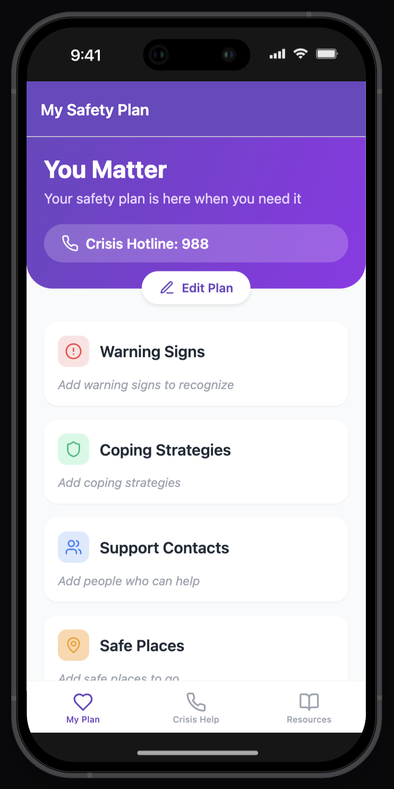

# Safety Planning App: Ready for a Crisis

[](https://github.com/ck37/suicide-safety-planning-app/actions/workflows/ci.yml)

A compassionate, evidence-based mobile application designed to help individuals create and maintain personalized safety plans for mental health crisis situations.



## 🌟 Overview

This app provides a digital implementation of the Stanley-Brown Safety Planning Intervention, a widely recognized suicide prevention tool used by mental health professionals. It empowers users to create personalized safety plans that can be accessed anytime, helping them navigate through difficult moments and connect with support resources.

For detailed information about the research foundation behind safety planning interventions, see our [Safety Planning for Adolescent Suicide Prevention research document](docs/Safety%20Planning%20for%20Adolescent%20Suicide%20Prevention.pdf).

## 🌐 Live Demo

View the live web version: [https://safety-planning-app.netlify.app/](https://safety-planning-app.netlify.app/)

*Note: The web version includes fallbacks for native features like biometric authentication, but provides full access to the core safety planning functionality.*

### 📱 iPhone App Demo with Expo

To experience the full native iPhone app with all features including biometric authentication:

1. **Install Expo Go** from the App Store on your iPhone
2. **Open the camera app** and scan this QR code or visit the Expo project page
3. **Launch in Expo Go** to run the native version with full iOS integration

The native version provides access to all features including:
- Face ID/Touch ID biometric authentication
- Native iOS notifications and alerts
- Optimized performance and native UI components
- Full offline functionality
- Voice activation features

*For the most authentic experience and to test all security features, we recommend using the native iOS version through Expo Go.*

### 🤖 Android App Demo with Expo

To experience the full native Android app with all features including biometric authentication:

1. **Install Expo Go** from the Google Play Store on your Android device
2. **Open the camera app** and scan this QR code or visit the Expo project page
3. **Launch in Expo Go** to run the native version with full Android integration

The native Android version provides access to all features including:
- Fingerprint/Face unlock biometric authentication
- Native Android notifications and system integration
- Optimized performance and Material Design components
- Full offline functionality
- Voice activation features

*The Android version offers the same comprehensive feature set as iOS, optimized for Android's security and notification systems.*

## ✨ Features

### Core Safety Plan Components
- **Warning Signs Recognition** - Identify personal warning signs that indicate a crisis may be developing
- **Coping Strategies** - Document healthy coping mechanisms and self-soothing techniques
- **Support Contacts** - Maintain a list of trusted people who can provide help and support
- **Safe Places** - Identify environments that promote safety and well-being
- **Reasons for Living** - Remember personal motivations and values that provide hope

### Crisis Management & Emergency Features
- **Quick Crisis Button** - Large, always-visible crisis button on home screen for immediate safety plan access
- **Crisis Hotline Integration** - One-tap access to the 988 Suicide & Crisis Lifeline
- **Voice-Activated Safety Plan** - Voice commands to read safety plan aloud when users can't focus on reading
- **Mood Tracking with Crisis Detection** - Daily mood check-ins with intelligent pattern analysis to identify potential crisis situations
- **Smart Notifications** - Intelligent, context-aware reminders including daily check-ins, mood tracking reminders, crisis support messages, safety plan review reminders, and encouragement notifications based on mood patterns and user behavior
- **Offline Functionality** - Safety plan remains accessible without internet connection

### Security & Privacy Features
- **Biometric Authentication** - Fingerprint, Face ID, or iris authentication to protect sensitive mental health data
- **Stealth Mode** - Disguise app appearance for users in unsafe living situations
- **Auto-Lock Protection** - Configurable automatic locking after periods of inactivity
- **Device-Level Encryption** - All data secured using device-level encryption and secure storage
- **Privacy-Focused** - All data remains on the user's device with no external data collection

### Accessibility & User Experience
- **Cross-Platform** - Available on iOS, Android, and Web
- **Intuitive Interface** - Clean, accessible design optimized for crisis situations
- **Multiple Access Methods** - Touch, voice, and visual interfaces for different user needs
- **Crisis-Optimized Design** - Large buttons and clear navigation for use during distressing moments
- **Comprehensive Testing** - Automated quality assurance with linting and code quality checks

## 🚀 Future Development

See our [Feature Wishlist](FEATURE_WISHLIST.md) for planned improvements and potential new features that could enhance the app's effectiveness in supporting mental health and suicide prevention.

## 💻 For Developers

Interested in contributing? See our [Developer Documentation](DEVELOPERS.md) for complete setup instructions, technical details, and contribution guidelines.

**Quick Start:**
```bash
git clone https://github.com/ck37/suicide-safety-planning-app.git
cd suicide-safety-planning-app
bun install
bun run start
```

**Tech Stack:** React Native, Expo, TypeScript, Zustand, NativeWind

## 📱 Usage

### Creating Your Safety Plan

1. **Launch the app** and navigate through the welcome screens
2. **Tap "Edit Plan"** to begin customizing your safety plan
3. **Fill out each section** with personalized information:
   - Add warning signs you've noticed before
   - List coping strategies that work for you
   - Include trusted contacts with phone numbers
   - Identify safe places you can go
   - Write down your reasons for living

### During a Crisis

1. **Open the app** to access your safety plan immediately
2. **Review your coping strategies** and try the techniques you've listed
3. **Contact support people** from your personalized list
4. **Use the Crisis Hotline button** for immediate professional support (988)
5. **Go to a safe place** from your identified locations


## 🔒 Privacy & Security

- **Local Storage Only**: All safety plan data is stored locally on the user's device
- **No Data Collection**: The app does not collect, transmit, or store personal information on external servers
- **Offline Functionality**: Safety plans remain accessible without internet connection
- **Secure**: Uses device-level encryption for stored data

## 🤝 Contributing

We welcome contributions that improve the app's effectiveness in supporting mental health. Please see our:

- [Contributing Guidelines](CONTRIBUTORS.md) - Important guidelines for working on mental health applications
- [Developer Documentation](DEVELOPERS.md) - Technical setup and development information
- [Feature Wishlist](FEATURE_WISHLIST.md) - Planned improvements and feature requests

## 📞 Crisis Resources

If you or someone you know is in immediate danger:

- **Call 911** (US) or your local emergency number
- **Call or text 988** - Suicide & Crisis Lifeline (US)
- **Text "HELLO" to 741741** - Crisis Text Line

### International Resources

- **Australia**: 13 11 14 (Lifeline Australia)
- **UK**: 116 123 (Samaritans)
- **Canada**: 1-833-456-4566 (Talk Suicide Canada)

## ⚠️ Important Disclaimer

This app is designed to supplement, not replace, professional mental health care. It should be used as part of a comprehensive safety plan developed with a mental health professional. If you are experiencing a mental health crisis, please seek immediate professional help.

## 📄 License

This project is licensed under the MIT License - see the [LICENSE](LICENSE) file for details.

##  Acknowledgments

- Based on the Stanley-Brown Safety Planning Intervention
- Inspired by evidence-based suicide prevention research
- Built with gratitude for mental health advocates and survivors

---

**Remember: You matter. Your life has value. Help is available.**
